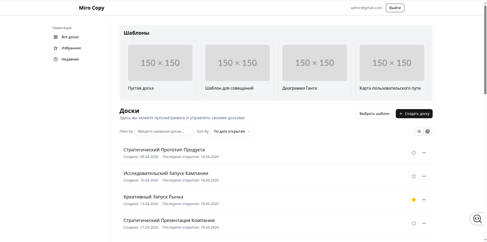

# Miro-like Collaborative Whiteboard - Frontend Application

[](LICENSE)
[](https://www.typescriptlang.org/)
[](https://react.dev/)
[](https://vite.dev/)
[](https://tanstack.com/query)
[](https://tailwindcss.com/)
[](https://ui.shadcn.com/)
[](https://mswjs.io/)
[](https://reactrouter.com/)
[](https://react-hook-form.com/)
[](https://zod.dev/)
[](https://www.openapis.org/)

## 📌 Overview

**Miro Boards** is an web application for collaborative whiteboarding, inspired by Miro.  
The project implements core features: authentication, board management (create, rename, favorite, delete), board listing with pagination and filtering, and template selection for new boards.

The architecture is designed for scalability, strong typing, and separation of concerns.  
**Mock Service Worker (MSW)** is heavily used during development, enabling frontend work independently of the backend.



---

<!-- TOC -->
* [Miro-like Collaborative Whiteboard - Frontend Application](#miro-like-collaborative-whiteboard---frontend-application)
  * [📌 Overview](#-overview)
  * [🧰 Technology Stack](#-technology-stack)
  * [⚙️ Configuration & Environment](#-configuration--environment)
    * [Environment Variables](#environment-variables)
    * [Scripts](#scripts)
  * [🔐 Authentication & Session Management](#-authentication--session-management)
  * [🌐 Working with the API](#-working-with-the-api)
    * [Type Generation](#type-generation)
    * [HTTP Clients](#http-clients)
    * [Mocks (MSW)](#mocks-msw)
  * [🧭 Routing](#-routing)
  * [🎨 UI Kit & Styling](#-ui-kit--styling)
  * [🧠 State Management](#-state-management)
  * [🧪 Development & Code Quality](#-development--code-quality)
    * [Linting](#linting)
    * [Formatting](#formatting)
    * [Absolute Imports](#absolute-imports)
  * [🚀 Getting Started](#-getting-started)
  * [📦 Production Build](#-production-build)
  * [🤝 Contributing](#-contributing)
  * [License](#license)
<!-- TOC -->

## 🧰 Technology Stack

| Category                 | Technologies                                                                                                 |
|--------------------------|--------------------------------------------------------------------------------------------------------------|
| **Language**             | TypeScript 5.7                                                                                               |
| **Framework**            | React 19                                                                                                     |
| **Build Tool**           | Vite 6                                                                                                       |
| **Routing**              | React Router 7 (data routers, lazy loading)                                                                  |
| **Data Management**      | TanStack Query (React Query) + `openapi-react-query`<br/>Global state – `create-gstore` (Zustand-like store) |
| **HTTP Client**          | `openapi-fetch` (typed client based on OpenAPI)                                                              |
| **API Type Generation**  | `openapi-typescript` from OpenAPI specification (YAML)                                                       |
| **API Mocking**          | MSW 2.x (browser integration)                                                                                |
| **UI Components**        | shadcn/ui (Radix UI + Tailwind CSS)                                                                          |
| **Styling**              | Tailwind CSS 4 + `tw-animate-css`                                                                            |
| **Forms & Validation**   | React Hook Form + Zod                                                                                        |
| **Authentication**       | JWT (access token in localStorage, refresh token in httpOnly cookie)                                         |
| **Linting / Formatting** | ESLint 9 + Prettier + `eslint-plugin-boundaries` (enforces architectural boundaries)                         |
| **Monorepo**             | Not used (single package), but module structure aligns with Feature-Sliced Design                            |

---

## ⚙️ Configuration & Environment

### Environment Variables

Create a `.env` file in the project root:

```env
VITE_API_BASE_URL=http://localhost:5173   # When using MSW, should match the app's origin
```

### Scripts

| Command           | Purpose                                                                               |
|-------------------|---------------------------------------------------------------------------------------|
| `npm run dev`     | Start Vite dev server with MSW enabled                                                |
| `npm run build`   | Type-check and build the application (`tsc -b && vite build`)                         |
| `npm run preview` | Preview the built application                                                         |
| `npm run lint`    | Run ESLint                                                                            |
| `npm run api`     | Generate TypeScript types from the OpenAPI spec (`./src/shared/api/schema/main.yaml`) |

---

## 🔐 Authentication & Session Management

- **Access Token** is stored in `localStorage` (key `token`).  
- **Refresh Token** is transmitted via an httpOnly cookie (set by the server / mocks).  
- Every request through `fetchClient` checks token expiration. If expired, `refreshToken` is automatically called to obtain a new token pair and retry the original request.  
- All session logic is encapsulated in `shared/model/session.ts` (a `create-gstore` store).

---

## 🌐 Working with the API

### Type Generation

The OpenAPI specification is described in YAML files (`src/shared/api/schema/`).  
After modifying the specification, run:

```bash
npm run api
```

The generated file `generated.ts` contains `paths` and `components["schemas"]` types, exported as `ApiPaths` and `ApiSchemas`.

### HTTP Clients

- **`fetchClient`** – `openapi-fetch` instance for authorized requests.  
  Uses middleware to add the `Authorization` header and automatically refresh tokens.  
- **`publicFetchClient`** – client for public endpoints (login, register, refresh).  

Based on these clients, **React Query** clients are created:
- `rqClient` (private)  
- `publicRqClient` (public)  

Query hooks are automatically generated by `openapi-react-query` and are fully typed.

### Mocks (MSW)

- Mocks are enabled **only in development mode**.  
- `main.tsx` calls `enableMocking()`, which starts the MSW worker in the browser.  
- Implemented mocks:
  - **Authentication**: login, register, token refresh (with JWT validation).  
  - **Boards**: list with pagination, sorting, and filtering; create, rename, favorite, delete.

---

## 🧭 Routing

**React Router 7** is used with Data API support (loaders, lazy routes).  

Routes are defined in `src/shared/model/routes.ts`.  
Router configuration is in `src/app/router.tsx`.

- Public pages: `/login`, `/register`.  
- Protected routes (require authentication): `/`, `/boards`, `/boards/favorite`, `/boards/recent`, `/boards/:boardId`.  

Protection is implemented via:
- `protectedLoader` – verifies token **before** rendering the page.  
- `ProtectedRoute` – wrapper component that redirects to login if no session exists.  

Lazy loading of features is configured using `lazy` in the router.

---

## 🎨 UI Kit & Styling

- Foundation components are from **shadcn/ui**, customized to the project’s design system.  
- All components reside in `src/shared/ui/kit/` and are imported via the `@/shared/ui/kit` alias.  
- Styling is done with **Tailwind CSS 4**.  
- The `cn()` utility (from `@/shared/lib/css`) is used for conditional class merging.  
- Animations are included via the `tw-animate-css` plugin.

---

## 🧠 State Management

- **Server state** – fully covered by TanStack Query (caching, invalidation, mutations).  
- **Client state** – lightweight store based on `create-gstore` (Zustand-like API).  
  - `useSession` – manages the token, provides `login`, `logout`, `refreshToken`.  
  - `useTemplatesModal` – manages the template selection modal state.

---

## 🧪 Development & Code Quality

### Linting

- ESLint 9 with configuration for TypeScript, React, and React Hooks.  
- Additionally, `eslint-plugin-boundaries` enforces architectural boundaries (e.g., `shared` must not import from `features`).

### Formatting

- Prettier with default settings.

### Absolute Imports

Configured via `vite-tsconfig-paths` and defined in `tsconfig.app.json`:

```json
"paths": {
  "@/*": ["src/*"]
}
```

---

## 🚀 Getting Started

1. **Install dependencies**  
   ```bash
   npm install
   ```

2. **Create a `.env` file** (see example above)

3. **Start the dev server**  
   ```bash
   npm run dev
   ```

4. **Open in browser**  
   [http://localhost:5173](http://localhost:5173)

5. **Mock login credentials**  
   - Email: `admin@gmail.com`  
   - Password: `123456`

---

## 📦 Production Build

```bash
npm run build
```

The output will be in the `dist/` folder.  
**Important:** In production builds, MSW is **not included**; requests go to the real backend specified in `VITE_API_BASE_URL`.

---

## 🤝 Contributing

1. Follow the module structure (Feature-Sliced Design).  
2. When adding new endpoints, update the OpenAPI specification first, then regenerate types (`npm run api`).  
3. Use `rqClient` / `publicRqClient` for requests – hooks are auto-generated and typed.  
4. Place UI components not tied to a specific feature in `shared/ui/kit/`.  
5. Ensure the code passes linting before committing (`npm run lint`).

---

## License

MIT © [Aleksey Tarasenko](https://github.com/alekstar79)
